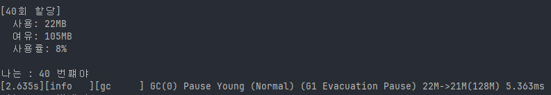
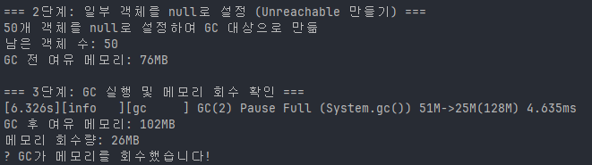

## 실험 내용
- 메모리 설정 : Xmx 256m, Xms 128m
- GC 알고리즘 : G1 Gc
## 1회차 실험

### 1단계
list.add(new byte[1024 * 1024]); // 1MB### 관찰 결과
- GC 로그:
    - `Pause Young (Concurrent Start) (G1 Humongous Allocation)`
- 특징:
    - **Humongous Allocation** 계속 발생
    - Eden/Survivor/Old 이동보다는 **Humongous 영역**에 바로 박힘
- 메모리 사용:
    - 적은 횟수 할당만 해도 메모리 확 치솟음
    - Young GC가 있어도 Humongous라서 기대한 모양의 움직임이 안 보임
### 결론
- 1MB는 G1에서 **Region(1MB) 크기의 50%이상 이라 Humongous로 분류됨
- 내가 보고 싶었던 "Eden -> Survivor -> Old" 이런 전형적인 young GC 그림을 보기엔 부적절한 크기 였다.

---

## 2회차 실험

### 1단계
객체당 크기를 50으로 만듬

- 객체가 작고 여러개 모여서 Eden에 쌓이는 느낌이 잘 드러남
- young GC 발생!!!
- Eden에 있던 객체들이 Survivor로 이동하거나 회수되는 그림을 볼 수 있음

### 2단계
- 50개의 객체를 null로 설정
- `list.removeIf(obj -> obj == null);`
- GC 전 여유 메모리 76MB

### 3단계
- System.gc()로 Full GC (권장하지 않는 방법이지만 궁금해서 해봄)
- GC후 여유 메모리 102MB
- 메모리 회수량 25MB

---
## 시행착오

- 객체 크기를 변경하고 실행 시켰는데 계속 같은 반응
- 알고보니 build를 안함

- 빌드 후 50 -> 500 -> 512 순으로 객체의 크기를 조정
- 512kb부터 humongous 발생