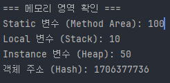
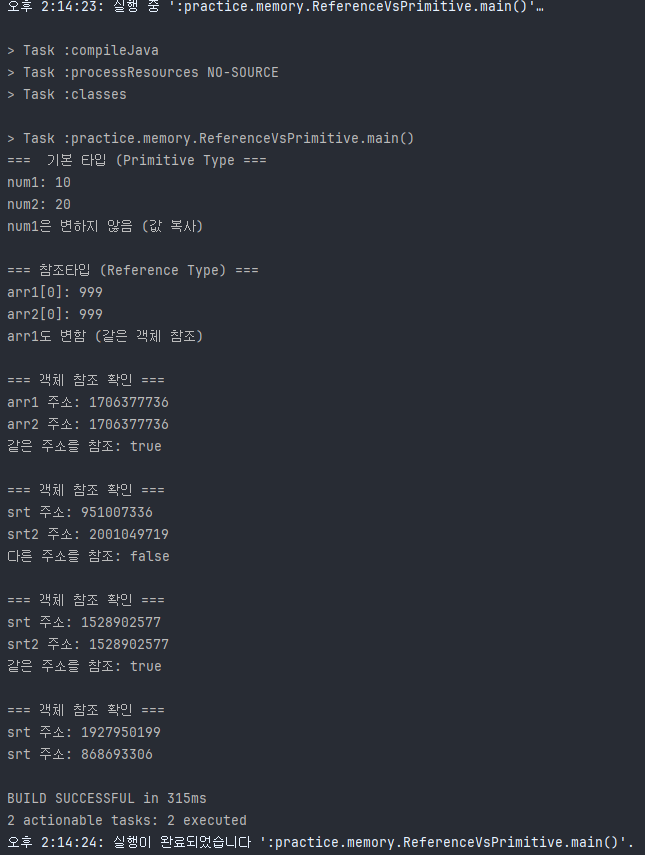

## 메모리 영역 실습

## 목표
- Method Area, Stack Area, Heap Area의 차이 이해
- 각 메모리 영역에 어떤 데이터가 저장되는지 확인
- Stack Frame의 동작 과정 이해
- 참조 타입 vs 기본 타입의 메모리 할당 차이

## 실습 단계

### 1단계 : 메모리 영역 기본 실습
`MemoryAreaDemo.java` 확인

### 2단계 : 실행 및 결과 확인

### 3단계 : Stack Frame 동작 확인
`StackFrameDemo.java` 파일 확인

### 4단계 : Stack Frame 실행 결과 확인

**확인 사항**
- 메서드 호출 순서 : main() -> method1() -> method2()
- Stack Frame 제거 순서: method2() -> method1() -> main()
- 각 메서드의 지역 변수는 독립적

### 5단계 : 참조 타입 vs 기본 타입
`ReferenceVsPrimitive.java` 파일 확인

### 6단계 : 실행 결과 확인

## 핵심 정리
- **Method Area** : static 변수, 클래스 정보 저장(모든 스레드 공유)
- **Stack Area** :  지역 변수, 매개변수 저장 (스레드별 생성, LIFO)
- **Heap Area** :  객체, 배열 저장(모든 스레드 공유, GC 대상)
- 
